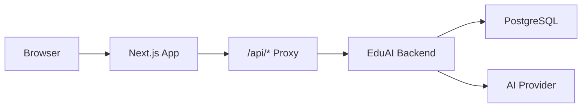

# EduAI Frontend

Modern web client for **EduAI**, an AI-powered e-learning platform. Built with Next.js and TypeScript, this application delivers the public marketing experience, course discovery, role-based dashboards, and integrations with the EduAI backend for authentication, course management, and AI-assisted learning.

---

## Table of Contents

- [Overview](#overview)
- [Features](#features)
- [Technology Stack](#technology-stack)
- [Prerequisites](#prerequisites)
- [Getting Started](#getting-started)
- [Environment Variables](#environment-variables)
- [Available Scripts](#available-scripts)
- [Project Structure](#project-structure)
- [Architecture](#architecture)
- [Deployment](#deployment)
- [Demo Accounts](#demo-accounts)
- [Related Documentation](#related-documentation)

---

## Overview

EduAI Frontend is the user-facing layer of the EduAI platform. It communicates with a separate **Express/Node.js backend** through a built-in API proxy, keeping credentials on the same origin and avoiding cross-origin issues in the browser.

The application supports three primary roles:

| Role | Dashboard path | Primary capabilities |
|------|----------------|----------------------|
| **Student** | `/dashboard/user` | Enroll in courses, track progress, take quizzes, use the AI study assistant |
| **Instructor** | `/dashboard/instructor` | Manage courses, lessons, analytics, and student visibility |
| **Administrator** | `/dashboard/admin` | Platform analytics, user management, enrollments, reviews, and course administration |

Public routes include the landing page, course catalog, blog, and static informational pages (About, Contact, Help, Privacy).

---

## Features

### Public & Marketing

- Responsive landing page with hero, categories, featured courses, and newsletter sections
- Course catalog with search, filtering, sorting, and pagination
- Course detail pages with enrollment and reviews
- Informational pages: About, Blog, Contact, Help, Privacy

### Authentication & Security

- Email/password registration and sign-in via [Better Auth](https://www.better-auth.com/)
- Google OAuth support (configured on the backend)
- Session-based authentication with HTTP-only cookies
- Next.js middleware protection for dashboard routes
- Role-based access enforced in dashboard layouts

### Student Experience

- Personal dashboard with enrollment overview and progress
- Interactive course player with lesson content
- Quizzes with attempt tracking
- AI study assistant with session history and Markdown-rendered responses
- AI-powered course recommendations on the dashboard
- Achievements, profile, and account settings
- Light and dark theme support

### Instructor & Admin

- Instructor dashboard for course and student management
- Admin dashboard with analytics charts (Recharts), user administration, enrollments, and reviews
- AI-assisted course creation: description generation, auto-tagging/classification, and quiz generation (via backend)

### Developer Experience

- TypeScript throughout
- Typed API client (`src/lib/api.ts`) with Axios interceptors
- TanStack Query for server state and caching
- ShadCN UI components on Radix primitives
- Turbopack-enabled development server

---

## Technology Stack

| Category | Technologies |
|----------|--------------|
| **Framework** | [Next.js 16](https://nextjs.org/) (App Router), React 19, TypeScript |
| **Styling** | Tailwind CSS, [shadcn/ui](https://ui.shadcn.com/), Framer Motion |
| **State & Data** | Zustand (auth), TanStack Query v5, Axios |
| **Forms & Validation** | React Hook Form, Zod |
| **Authentication** | Better Auth (client) |
| **Charts** | Recharts |
| **Notifications** | Sonner |
| **Deployment** | Vercel (recommended) |

---

## Prerequisites

- **Node.js** 18.18 or later (20+ recommended)
- **npm** 9+ (or compatible package manager)
- A running instance of the [EduAI backend](https://github.com) (local or deployed) for API and authentication

---

## Getting Started

### 1. Clone the repository

```bash
git clone <repository-url>
cd eduai-frontend
```

### 2. Install dependencies

```bash
npm install
```

### 3. Configure environment variables

Create a `.env.local` file in the project root (see [Environment Variables](#environment-variables)).

### 4. Start the backend

Ensure the EduAI backend is running and reachable at the URL you configure (default: `http://localhost:5000`).

### 5. Run the development server

```bash
npm run dev
```

Open [http://localhost:3000](http://localhost:3000) in your browser.

The dev server uses Turbopack (`next dev --turbopack`) for faster local builds.

---

## Environment Variables

Create `.env.local` in the project root with the following variables:

| Variable | Required | Description | Example |
|----------|----------|-------------|---------|
| `NEXT_PUBLIC_API_URL` | Yes | Base URL of the EduAI backend (used by the API proxy) | `http://localhost:5000` |
| `NEXT_PUBLIC_APP_URL` | Yes | Public URL of this frontend (auth callbacks, metadata) | `http://localhost:3000` |
| `BACKEND_API_URL` | No | Server-side fallback for the proxy if `NEXT_PUBLIC_API_URL` is unset | `http://localhost:5000` |
| `BETTER_AUTH_URL` | No | Auth base URL override in production | Same as `NEXT_PUBLIC_APP_URL` |

**Example `.env.local` for local development:**

```env
NEXT_PUBLIC_API_URL=http://localhost:5000
NEXT_PUBLIC_APP_URL=http://localhost:3000
```

> **Note:** AI provider keys (e.g. Groq, Gemini) belong in the **backend** environment, not in this frontend repository. See [AI_README.md](./AI_README.md) for AI configuration details.

---

## Available Scripts

| Command | Description |
|---------|-------------|
| `npm run dev` | Start the development server with Turbopack |
| `npm run build` | Create an optimized production build |
| `npm run start` | Serve the production build |
| `npm run lint` | Run ESLint (Next.js config) |

---

## Project Structure

```
eduai-frontend/
├── src/
│   ├── app/                          # Next.js App Router
│   │   ├── page.tsx                  # Landing page
│   │   ├── layout.tsx                # Root layout, theme, providers
│   │   ├── globals.css
│   │   ├── api/[...proxy]/           # Backend API proxy
│   │   ├── auth/                     # Login, register, OAuth callback
│   │   ├── courses/                  # Catalog and course detail
│   │   ├── dashboard/
│   │   │   ├── user/                 # Student dashboard
│   │   │   ├── instructor/           # Instructor dashboard
│   │   │   └── admin/                # Admin dashboard
│   │   ├── about/ | blog/ | contact/ | help/ | privacy/
│   ├── components/
│   │   ├── ui/                       # shadcn/ui primitives
│   │   ├── shared/                   # Navbar, Footer, CourseCard, QueryProvider
│   │   └── landing/                  # Landing page sections
│   ├── lib/
│   │   ├── api.ts                    # Axios client and API modules
│   │   ├── auth-client.ts            # Better Auth React client
│   │   ├── auth-utils.ts
│   │   └── utils.ts
│   ├── store/
│   │   └── auth.store.ts             # Zustand auth state
│   ├── types/
│   │   └── index.ts                  # Shared TypeScript interfaces
│   └── middleware.ts                 # Route protection
├── public/
├── next.config.ts
├── tailwind.config.ts
├── components.json                   # shadcn/ui configuration
├── vercel.json                       # Vercel deployment hints
└── package.json
```

---

## Architecture

### Request flow

All browser API calls use relative paths (e.g. `/api/courses`). Next.js forwards them to the backend through a catch-all proxy route.



### API proxy

The proxy at `src/app/api/[...proxy]/route.ts`:

- Forwards `/api/*` requests to `NEXT_PUBLIC_API_URL`
- Preserves cookies and rewrites `Set-Cookie` headers for the frontend origin
- Avoids CORS configuration for same-origin API calls from the client

### Authentication

- **Middleware** (`src/middleware.ts`): Redirects unauthenticated users away from `/dashboard/*` routes.
- **Layouts**: Each dashboard layout validates the user's role (Student, Instructor, Admin) using `useSession()` and backend role data.
- **Axios interceptor** (`src/lib/api.ts`): Redirects to `/auth/login` on `401` responses, except for expected auth endpoints.

### Key API modules

| Module | Responsibility |
|--------|----------------|
| `authApi` | Session, profile, demo seeding |
| `coursesApi` | CRUD, lessons, instructor courses |
| `enrollmentsApi` | Enroll, progress, my enrollments |
| `reviewsApi` | Course reviews |
| `usersApi` | Profile and admin user management |
| `aiApi` | Chat, recommendations, content generation |
| `quizApi` | Quizzes and attempts |

---

## Deployment

### Vercel (recommended)

1. Push the repository to GitHub (or connect your Git provider).
2. Import the project in [Vercel](https://vercel.com/).
3. Set environment variables in the Vercel project settings:

   | Variable | Production value |
   |----------|------------------|
   | `NEXT_PUBLIC_API_URL` | Your deployed backend URL |
   | `NEXT_PUBLIC_APP_URL` | Your Vercel frontend URL |
   | `BETTER_AUTH_URL` | Same as `NEXT_PUBLIC_APP_URL` |

4. Deploy. Vercel detects Next.js automatically; `vercel.json` may include default env hints for this project.

### Production checklist

- [ ] Backend is deployed and `NEXT_PUBLIC_API_URL` points to it
- [ ] `NEXT_PUBLIC_APP_URL` matches the live frontend URL
- [ ] Backend CORS/trusted origins include the frontend URL
- [ ] OAuth redirect URLs are updated for production domains
- [ ] Demo seed endpoints are disabled or secured in production

---

## Demo Accounts

When demo seeding is enabled on the backend, the following accounts may be available:

| Role | Email | Password |
|------|-------|----------|
| Student | `student@eduai.dev` | `student123` |
| Admin | `admin@eduai.dev` | `admin123` |

Use the login page or call `authApi.seedDemo()` only in development environments.

---

## Related Documentation

- **[AI_README.md](./AI_README.md)** — AI feature matrix, API routes, architecture, and backend environment setup for Groq/Gemini integrations.

---

## License

This project is private (`"private": true` in `package.json`). Contact the repository owner for licensing and usage terms.
